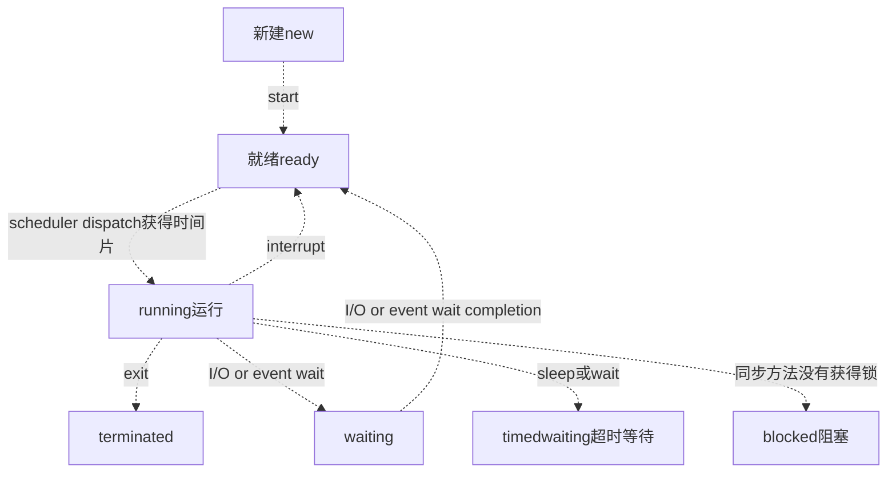

## 计算机基础知识


实习: 

操作系统问
进程线程区别


通信，io，Linux操作指令，死锁，多路复用

多路复用:


JAVA的话，大概会问hashmap和concurrenthashmap，网上资料很多的

算法能过，操作系统，计算机网络，数据库这些面试题，JAVA基础题会回答就行


刚开始说到了RPC框架，因为我的项目介绍里面有，就问到了Unicode字符集的问题，然后让我简单介绍字符集，Unicode和UTF-8的区别和联系：

计算机中我们常说的Buffer和cache有什么区别，Buffer的优点是什么：

buffer是缓冲,  io先放在buffer ,然后一起write.  cache是缓存, 离cpu近, 随时可以取.

Linux 常用命令，查看内存，cpu，进程，文件等


序列化和反序列化的相关知识，用过哪些，优缺点


二进制文件和json的优缺点及使用场景


https 为什么是混合加密(对称加密和非对称加密详细信息)


你对四次挥手的理解

#### TCP滑动窗口和拥塞控制

网络传输里面，除了发送方，接收方，还有个传输路径。

早期的TCP实现是没有拥塞窗口的，发送方会一次将接收方所建议的数据长度，也就是滑动窗口都发过去。如果传输路径没问题，例如发送方，接收方都在一个局域网，那自然没问题。

如果传输路径有问题，比如带宽有限，承受不了这么多数据，那就会走到TCP的确认重传机制。实际中，确认重传会进一步降低网络的负载能力，本来一趟能走完的数据，现在要走好几次。

所以TCP才提出了拥塞控制。拥塞窗口（congestion window）只是拥塞控制的一部分。它一个应用就是slow start，简单来说，就是TCP的发送方虽然收到了接收方的建议数据长度，但是TCP发送方也不知道传输路径负载能力如何。因此TCP的发送方开始只发一小段数据，当收到了ACK之后，再增加每次发送的数据，直到达到接收方的处理能力上限或者传输路径的负载能力上限。有点类似摸着石头过河。发送方每次发送的数据长度，就是拥塞窗口的大小。

## Java

JVM内存模式简单介绍，java8 和之前的区别，以及原因：


垃圾收集算法，CMS和G1垃圾收集器的介绍，每个垃圾收集器的优点、使用原因，不同内存区域垃圾收集器组合及组合限制：
常用的设计模式

单例


泛型的含义，实现方法，使用场景，通配符等


面对对象的基本知识，多态的理解


## MySQL


下面应该是秋招

InnoDB引擎 实现可重复读的方法，问的很深


脏读，不可重复读，幻读

**脏读:**举个例子,如果你正在读数据库内容,而我现在修改了数据库内容还没有提交,接着我修改后的内容没有提交的情况下被你读到了,就叫脏读.

**不可重复读:**举个例子,比如你正在读数据库内容,而我update数据库后提交了,你又读了一次数据库内容,这时出现两个内容不同的结果,这叫不可重复读.

**幻读**:举个例子,比如你正在读数据库内容,而我insert数据库后提交了,你又读了一次数据库内容,这时你看到内容出现了多一条数据,这叫幻读.


B+树优点


聚簇索引，非聚簇索引，回表的相关知识


联合索引的最左匹配(最左前缀)原则
explain，drop等语法考察
面试总时长是60分钟


优先刷剑指offer题目,用java做题，然后刷leetcode前100，这些题做着做着，差不多能把ds学得差不多了。 因为你只有一年时间，肯定不会有很多精力学计算机网络和操作系统的，走捷径的话就是硬背面试常考题， 


计算机网络面试常考的tcp三次握手四次挥手、tcp、udp区别, 拥塞窗口这几个，


操作系统面试常问的，网络io之类的，bio nio aio,多路复用，poll，eploo,sellect区别，银行家算法，死锁，进程线程区别。


 数据库这个考研408虽然不考，但是面试的时候这个是最喜欢会问的，mysql基本增删改查至少要会，然后背事务、b+树索引、锁、隔离、幻读、可重复读、脏读。


 java的一些基础面试题背一下，spring、springboot面试题背一下。 然后可以在csdn上找那种简单的 外卖订餐系统、电影院买票系统 视频教学 跟着做一下 动手实操一下spring+spring mvc + mybatis。 学有余力的话，学一下redis缓存、消息队列中间件、elasticsearch搜索引擎、spring cloud.

下面分享一下经验（**我先申明一下，以下所有内容都以功利性找工作为目标，就是让面试官觉得你屌，而不是让你真的变屌的思路，如果是已经工作的，可以不用看了**）： 重要性排序：**优先级递减** 第一档次:leetcode，数据库，语言基础，项目，jvm

 第二档次：计算机网络，操作系统 学到这里找个中厂的实习应该没问题了 

第三档次：各种框架，中间件，缓存，分布式知识等 

**1.学习顺序** 可以照着这个网课学，把SSM三大框架，还有springboot部分学完就行，如果每天从早学到晚脱产学习，从0基础到SpringBoot大概需要3~4个月 把这个网课学完以后，基本也就有了crud（搬砖）的能力，接下来的学习内容主要以应付面试为主

**2.leetcode** 我春招的时候（截止到今年4月中）大概做了200LC，拿了阿里腾讯美团百度的offer，字节投了5月份才联系我面试。。。就放弃了 秋招的时候（截止到今年9月中）大概做了350道LC，基本上手撕代码就没什么问题了。算法题是目前校招最重要的考察环节，连阿里都要手撕代码了，别的基础题你不会的话，你可以说一下子忘了，或者扯点相关的知识点，算法题不会就是不会，而且笔试是实打实的成绩。得重视一下。 **另外leetcode上的《剑指offer模块》和热门100题重点做** 

**3.数据库** 上面的网课学完了以后，工作中用到数据库基本的语法也就会了，我建议深入学习一下mysql进阶的知识，建议把数据库隔离级别、索引数据结构、为什么选B+树、各种索引失效情况、最左匹配原则，如何保证事务、MVCC原理与实现、Innodb和MyISAM的区别、如何对sql调优、聚集索引和非聚集索引、mysql有哪几种锁，如何解决幻读、三大范式等高频知识点做一个整理。也可以看看《高性能Mysql》 还有就是面试的时候可能会让你手撕sql，可以去leetcode上练几道 

**4.语言基础** 我上面给的链接是java的，如果想学c++可以自己找找，如果学java的话，可以看我上面那个视频资料 **5.项目** 说出来你可能不信，我就是做了秒杀虽然烂大街，但是好用。每次都能跟面试官扯好久,成功拖延面试时间。 当然我这是对于跨专业，且没有办法去实习的同学的建议，如果你本身是科班的，或者可以找个中厂的实习，其实企业的项目会好很多。或者也可以参加一些比赛（比如阿里的中间件比赛）。反正比赛项目或者实习项目，肯定比秒杀要好的

前提是你有这个时间去折腾，我因为只有1年时间所以来不及去折腾，只能搞了个秒杀 网上的秒杀系统项目很多，基本都大同小异，随便找一个做一下就行 B站上就有很多，举个例子 https://www.bilibili.com/video/BV1CJ411i7t8?from=search&seid=71672713836252527 如果是DIY的项目一定要突出亮点，**比如分布式锁，一致性哈希，削峰降级，多级缓存、限流算法、分布式事务等**

**6.JVM&并发相关** jvm对于java的同学来说绝对是个高频的考点，《深入理解java虚拟机》一定要好好看 并发相关知识也要学习一下，比如juc相关类，线程池相关知识、Synchronized和Lock的区别、AQS等。我的建议是先去B站找视频里看看了解基本用法和原理，然后再点到源码里看看，就会理解的比较透彻。比如我就利用AQS自己写了一个并发工具类，从此面试的时候遇到AQS都成了加分项 我同学说下面两个视频不错 https://www.bilibili.com/video/BV1V4411p7EF https://www.bilibili.com/video/BV1B7411L7tE 

**7.计算机网络，操作系统** 这两门课我都是把考研教材快速的过了一遍，大概1周看完了,看了感觉跟没看一样，然后刷了一下面筋，发现问来问去都是那些八股文：三次握手、四次挥手、tcp和udp的区别、http协议，进程与线程的区别等,这一块的复习，我建议快速过一遍教材或者网课后直接刷面筋，然后背就完了，这两门课的知识点很多，但是问来问去的知识点就那些，抓住那些常考的深入学习就行了，不常考的就算被问到了，直接说忘了，如果你算法题能做出来，面试大概率还是能通过的

**8、中间件，缓存，分布式知识** 

B站找视频学，这些中间件，我的建议是，先会用，再深入，最好能仿写。B站上找些视频学，可以快速的学习到用法，然后再去找源码看看深入理解原理，最好能做个仿写。我在秋招之前自己仿写了Spring，Dubbo，RxJava的代码，自己模仿着写了一些小框架。可以作为面试的加分项

最好还是自己没事去牛客翻翻，然后自己整理一份面筋资料是最好的。


## 进程和线程

一个进程中可以有多个线程, 多个线程共享进程的堆和方法区(元空间)资源, 但是线程有独立的PC程序计数器,栈

堆: 存放新创建的对象 

方法区主要用于存放已被加载的类信息、常量、静态变量、即时编译器编译后的代码等数据。

线程的状态



1. 互斥条件：该资源任意一个时刻只由一个线程占用。
2. 请求与保持条件：一个进程因请求资源而阻塞时，对已获得的资源保持不放。
3. 不剥夺条件:线程已获得的资源在未使用完之前不能被其他线程强行剥夺，只有自己使用完毕后才释放资源。
4. 循环等待条件:若干进程之间形成一种头尾相接的循环等待资源关系。

避免死锁

1. **破坏互斥条件** ：这个条件我们没有办法破坏，因为我们用锁本来就是想让他们互斥的（临界资源需要互斥访问）
2. **破坏请求与保持条件** ：一次性申请所有的资源。而不是获得一部分然后等另一部分.
3. **破坏不剥夺条件** ：占用部分资源的线程进一步申请其他资源时，如果申请不到，可以主动释放它占有的资源。
4. **破坏循环等待条件** ：靠按序申请资源来预防。所有人都要按某一顺序申请资源，没有a就不能申请b,释放资源则反序释放。破坏循环等待条件。

### 说说 sleep() 方法和 wait() 方法区别和共同点?

- 两者最主要的区别在于：**`sleep()` 方法没有释放锁，而 `wait()` 方法释放了锁** 。
- 两者都可以暂停线程的执行。
- `wait()` 通常被用于线程间交互/通信，`sleep() `通常被用于暂停执行。
- `wait()` 方法被调用后，线程不会自动苏醒，需要别的线程调用同一个对象上的 `notify() `或者 `notifyAll()` 方法。`sleep() `方法执行完成后，线程会自动苏醒。或者可以使用 `wait(long timeout)` 超时后线程会自动苏醒。

### 调用 start() 方法时会执行 run() 方法，为什么不能直接调用 run() 方法

new 一个 Thread，线程进入了新建状态。调用 `start()`方法，会启动一个线程并使线程进入了就绪状态，当分配到时间片后就可以开始运行了。 `start()` 会执行线程的相应准备工作，然后自动执行 `run()` 方法的内容，这是真正的多线程工作。 但是，直接执行 `run()` 方法，会把 `run()` 方法当成一个 main 线程下的普通方法去执行，并不会在某个线程中执行它，所以这并不是多线程工作。

**总结： 调用 `start()` 方法方可启动线程并使线程进入就绪状态，直接执行 `run()` 方法的话不会以多线程的方式执行。**


### Java 容器

#### arraylist

 底层实现, 默认为10 , *//扩容newCapacity = (int) ( 1.5 \* oldCapacity )*

- 如果提前知道数组元素较多，可以在添加元素前通过调用ensureCapacity()方法提前增加容量以减小后期容量自动增长的开销。
-  \* 也可以通过带初始容量的构造器初始化这个容量。

-  ArrayList不是线程安全的。
-  \* 如果需要应用到多线程中，需要在外部做同步

```java
 private void grow(int minCapacity) {
    	 // 获取到ArrayList中elementData数组的内存空间长度
        int oldCapacity = elementData.length;
        // 扩容到原来的1.5倍
        int newCapacity = oldCapacity + (oldCapacity >> 1);
        // 判断一下新数组的长度容量够不够，够了就直接使用这个长度创建数组
        // 不够就将数组长度设置为需要的长度
        if (newCapacity - minCapacity < 0)
            newCapacity = minCapacity;
        // 判断预设值的大小是否超过了默认的最大值
        if (newCapacity - MAX_ARRAY_SIZE > 0)
            newCapacity = hugeCapacity(minCapacity);
        // 调用Arrays.copyOf方法将elementData数组指向新的内存空间时newCapacity的连续空间
        // 并将elementData的数据复制到新的内存空间
        elementData = Arrays.copyOf(elementData, newCapacity);
    }
```


#### hashmap, concurrentmap

JDK1.8的实现降低锁的粒度，JDK1.7版本锁的粒度是基于Segment的，包含多个HashEntry，而JDK1.8锁的粒度就是HashEntry（首节点）

JDK1.8版本的数据结构变得更加简单，使得操作也更加清晰流畅，因为已经使用synchronized来进行同步，所以不需要分段锁的概念，也就不需要Segment这种数据结构了，由于粒度的降低，实现的复杂度也增加了

JDK1.8使用红黑树来优化链表，基于长度很长的链表的遍历是一个很漫长的过程，而红黑树的遍历效率是很快的，代替一定阈值的链表，这样形成一个最佳拍档.

在1.8中ConcurrentHashMap的get操作全程不需要加锁，这也是它比其他并发集合比如hashtable、用Collections.synchronizedMap()包装的hashmap;安全效率高的原因之一。

get操作全程不需要加锁是因为Node的成员val是用volatile修饰的和数组用volatile修饰没有关系。

数组用volatile修饰主要是保证在数组扩容的时候保证可见性.

#### volatile

第一：使用volatile关键字会强制将修改的值立即写入主存；

第二：使用volatile关键字的话，当线程2进行修改时，会导致线程1的工作内存中缓存变量的缓存行无效（反映到硬件层的话，就是CPU的L1或者L2缓存中对应的缓存行无效）；

第三：由于线程1的工作内存中缓存变量的缓存行无效，所以线程1再次读取变量的值时会去主存读取。

笔试: 输入有分隔的时候.

```java
 public static String[] ss = new String[20];
   public SplitDemo() {
​     String s = "The rain in Spain falls mainly in the plain.";
​     // 在每个空格字符处进行分解。
​     ss = s.split(" ");
   }
```


### 高并发怎么办?哪里会先出问题? 

- **系统集群化**
- **数据库层面的分库分表+读写分离**
- **针对读多写少的请求，引入缓存集群**
- **针对高写入的压力，引入消息中间件集群**，

如果你的系统内处理的是较为复杂的一些业务逻辑，是那种重业务逻辑的系统的话，是比较耗费CPU的。

你可以在前面挂一个负载均衡层，把请求均匀打到系统层面，让系统可以用多台机器集群化支撑更高的并发压力。比如说这里假设给系统增加部署一台机器，那么每台机器就只有250/s的请求了。

然后 , 数据库不行了 

得对系统做分库分表 + 读写分离，也就是把一个库拆分为多个库，部署在多个数据库服务上，这是作为主库承载写入请求的。

然后每个主库都挂载至少一个从库，由从库来承载读请求。

然后, 不能只加机器,

你完全可以根据系统的业务特性，对那种**写少读多的请求，引入缓存集群**。

具体来说，就是在写数据库的时候同时写一份数据到缓存集群里，然后用缓存集群来承载大部分的读请求。

这样的话，通过缓存集群，就可以用更少的机器资源承载更高的并发。

- **不要盲目进行数据库扩容，数据库服务器成本昂贵，且本身就不是用来承载高并发的**
- **针对写少读多的请求，引入缓存集群，用缓存集群抗住大量的读请求**


**6）引入消息中间件集群**

假如说，你现在每秒是1000/s次写请求，其中比如500次请求是必须请求过来立马写入数据库中的，但是另外500次写请求是可以允许异步化等待个几十秒，甚至几分钟后才落入数据库内的。

那么此时你完全可以引入消息中间件集群，把允许异步化的每秒500次请求写入MQ，然后基于MQ做一个削峰填谷。比如就以平稳的100/s的速度消费出来然后落入数据库中即可，此时就会大幅度降低数据库的写入压力。


### TOPk问题

使用hashmap，每一个元素维护一个出现次数：比如(“1”,1)对文件的每一个元素进行扫描，使用map.contains(“key”)判断是否存在，value的值加1，再map.put(key,value),如果不存在直接map.put(key,value);上述方法看似可行，但是耗内存，假设元素key占4个字节，value占4个字节，那么就是一共就是160亿个字节，也就是16G，一共需要消耗16个G的内存，这是肯定不合适的。

解决方法：

一次可以采用hash的方法将文件拆分成16个文件，每个文件大约就是一个G，然后对每一个文件进行hashMap操作，大约需要消耗2个G，看起来是可行的。在每一个文件求出Top1，一共就有16个Top1，然后在16个Top1中求出最后的那个Top1

#### 题目描述：找到100亿个URL中重复的URLTopk问题。

假设每一个Url占64个字节，那么大约就是64G的内存，可以根据O（n）时间复杂度hash分成64个小文件，每一个文件中统计词频，维护大小为100 的小顶堆，最后生成的n个小顶堆，然后再外部使用排序获取TopK

#### 1千万个图片快速存取

在服务器上建立两级索引机制，由服务器接收来自于客户端的请求；所述索引机制的第一层为哈希桶，第二层为红黑树。

#### 一亿个数据去重内存不足


#### 位图法去重

比如大量重复电话号码， 可以用数组， a[i]=1为出现，a[i] = 0 为没出现， 然后遍历就可以知道。

hashset怎么去重？  先hashcode比较， 如果不一样就放， 如果一样用equal（）方法。

