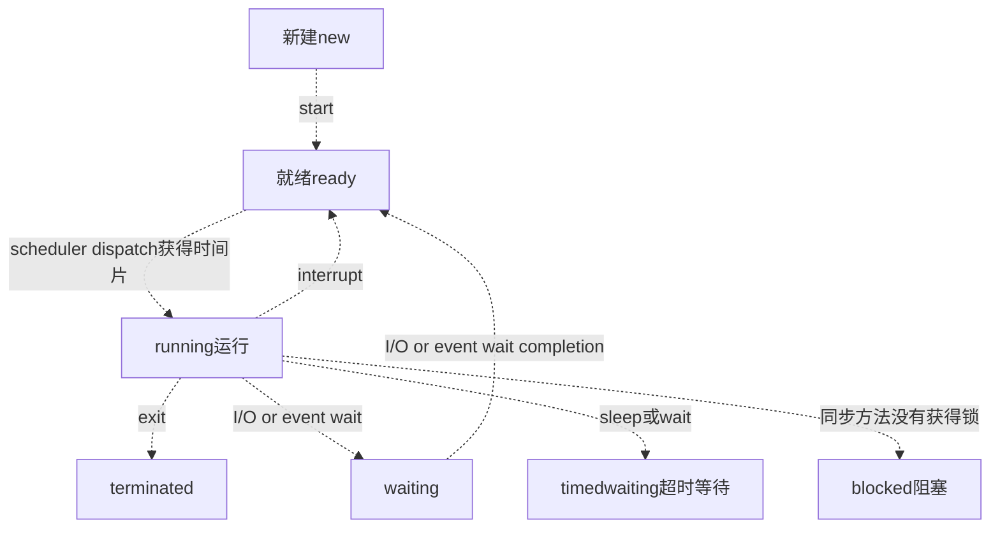

https://gitee.com/cosen1024/Java-Interview

多路复用:

JAVA的话，大概会问hashmap和concurrenthashmap，网上资料很多的

刚开始说到了RPC框架，因为我的项目介绍里面有，就问到了Unicode字符集的问题，然后让我简单介绍字符集，Unicode和UTF-8的区别和联系：

计算机中我们常说的Buffer和cache有什么区别，Buffer的优点是什么：

buffer是缓冲,  io先放在buffer ,然后一起write.  cache是缓存, 离cpu近, 随时可以取.

Linux 常用命令，查看内存，cpu，进程，文件等

序列化和反序列化的相关知识，用过哪些，优缺点

二进制文件和json的优缺点及使用场景

## Java

JVM内存模式简单介绍，java8 和之前的区别，以及原因：

垃圾收集算法，CMS和G1垃圾收集器的介绍，每个垃圾收集器的优点、使用原因，不同内存区域垃圾收集器组合及组合限制：

泛型的含义，实现方法，使用场景，通配符等

下面应该是秋招


面试总时长是60分钟

优先刷剑指offer题目,用java做题，然后刷leetcode前100，这些题做着做着，差不多能把ds学得差不多了。 因为你只有一年时间，肯定不会有很多精力学计算机网络和操作系统的，走捷径的话就是硬背面试常考题， 

操作系统面试常问的，网络io之类的，bio nio aio,多路复用，poll，eploo,sellect区别，银行家算法，死锁，进程线程区别。

 数据库这个考研408虽然不考，但是面试的时候这个是最喜欢会问的，mysql基本增删改查至少要会，然后背事务、b+树索引、锁、隔离、幻读、可重复读、脏读。

 java的一些基础面试题背一下，spring、springboot面试题背一下。 然后可以在csdn上找那种简单的 外卖订餐系统、电影院买票系统 视频教学 跟着做一下 动手实操一下spring+spring mvc + mybatis。 学有余力的话，学一下redis缓存、消息队列中间件、elasticsearch搜索引擎、spring cloud.

下面分享一下经验（**我先申明一下，以下所有内容都以功利性找工作为目标，就是让面试官觉得你屌，而不是让你真的变屌的思路，如果是已经工作的，可以不用看了**）： 重要性排序：**优先级递减** 第一档次:leetcode，数据库，语言基础，项目，jvm

 第二档次：计算机网络，操作系统 学到这里找个中厂的实习应该没问题了 

第三档次：各种框架，中间件，缓存，分布式知识等 

**1.学习顺序** 可以照着网课学，把SSM三大框架，还有springboot部分学完就行，如果每天从早学到晚脱产学习，从0基础到SpringBoot大概需要3~4个月 把这个网课学完以后，基本也就有了crud（搬砖）的能力，接下来的学习内容主要以应付面试为主

**2.leetcode** 算法题是目前校招最重要的考察环节，连阿里都要手撕代码了，别的基础题你不会的话，你可以说一下子忘了，或者扯点相关的知识点，算法题不会就是不会，而且笔试是实打实的成绩。得重视一下。 **另外leetcode上的《剑指offer模块》和热门100题重点做** 

**3.数据库** 上面的网课学完了以后，工作中用到数据库基本的语法也就会了，我建议深入学习一下mysql进阶的知识，建议把数据库隔离级别、索引数据结构、为什么选B+树、各种索引失效情况、最左匹配原则，如何保证事务、MVCC原理与实现、Innodb和MyISAM的区别、如何对sql调优、聚集索引和非聚集索引、mysql有哪几种锁，如何解决幻读、三大范式等高频知识点做一个整理。也可以看看《高性能Mysql》 还有就是面试的时候可能会让你手撕sql，可以去leetcode上练几道 

**4.语言基础** 我上面给的链接是java的，如果想学c++可以自己找找，如果学java的话，可以看我上面那个视频资料 

**5.项目** 说出来你可能不信，我就是做了秒杀虽然烂大街，但是好用。每次都能跟面试官扯好久,成功拖延面试时间。 当然我这是对于跨专业，且没有办法去实习的同学的建议，如果你本身是科班的，或者可以找个中厂的实习，其实企业的项目会好很多。或者也可以参加一些比赛（比如阿里的中间件比赛）。反正比赛项目或者实习项目，肯定比秒杀要好的

前提是你有这个时间去折腾，我因为只有1年时间所以来不及去折腾，只能搞了个秒杀 网上的秒杀系统项目很多，基本都大同小异，随便找一个做一下就行 B站上就有很多，举个例子 https://www.bilibili.com/video/BV1CJ411i7t8?from=search&seid=71672713836252527 如果是DIY的项目一定要突出亮点，**比如分布式锁，一致性哈希，削峰降级，多级缓存、限流算法、分布式事务等**

**6.JVM&并发相关** jvm对于java的同学来说绝对是个高频的考点，《深入理解java虚拟机》一定要好好看 并发相关知识也要学习一下，比如juc相关类，线程池相关知识、Synchronized和Lock的区别、AQS等。我的建议是先去B站找视频里看看了解基本用法和原理，然后再点到源码里看看，就会理解的比较透彻。比如我就利用AQS自己写了一个并发工具类，从此面试的时候遇到AQS都成了加分项 我同学说下面两个视频不错 https://www.bilibili.com/video/BV1V4411p7EF https://www.bilibili.com/video/BV1B7411L7tE 

**7.计算机网络，操作系统** 这两门课我都是把考研教材快速的过了一遍，大概1周看完了,看了感觉跟没看一样，然后刷了一下面筋，发现问来问去都是那些八股文：三次握手、四次挥手、tcp和udp的区别、http协议，进程与线程的区别等,这一块的复习，我建议快速过一遍教材或者网课后直接刷面筋，然后背就完了，这两门课的知识点很多，但是问来问去的知识点就那些，抓住那些常考的深入学习就行了，不常考的就算被问到了，直接说忘了，如果你算法题能做出来，面试大概率还是能通过的

**8、中间件，缓存，分布式知识** 

B站找视频学，这些中间件，我的建议是，先会用，再深入，最好能仿写。B站上找些视频学，可以快速的学习到用法，然后再去找源码看看深入理解原理，最好能做个仿写。我在秋招之前自己仿写了Spring，Dubbo，RxJava的代码，自己模仿着写了一些小框架。可以作为面试的加分项

#### 和 C++ 的区别?

- Java 不提供指针来直接访问内存，更加安全
- Java 的类是单继承的，C++ 支持多重继承；虽然 Java 的类不可以多继承，但是接口可以多继承。
- Java 有自动内存管理垃圾回收机制(GC)，不需要程序员手动释放无用内存。
- C ++同时支持方法重载和操作符重载，但是 Java 只支持方法重载（操作符重载增加了复杂性，这与 Java 最初的设计思想不符）

#### 进程和线程

一个进程中可以有多个线程, 多个线程共享进程的堆和方法区(元空间)资源, 但是线程有独立的PC程序计数器,栈

进程和线程最大的区别是，各进程是独立的，而各线程则不一定独立，因为同一进程中的多个线程极有可能会相互影响。线程执行开销小，但不利于资源的管理和保护，进程则相反。

堆: 存放新创建的对象 

方法区主要用于存放已被加载的类信息、常量、静态变量、即时编译器编译后的代码等数据。

线程的状态

[JAVA面试题 线程的生命周期包括哪几个阶段？ - Java蚂蚁 - 博客园 (cnblogs.com)](https://www.cnblogs.com/marsitman/p/11228684.html)



1. 互斥条件：该资源任意一个时刻只由一个线程占用。
2. 请求与保持条件：一个进程因请求资源而阻塞时，对已获得的资源保持不放。
3. 不剥夺条件:线程已获得的资源在未使用完之前不能被其他线程强行剥夺，只有自己使用完毕后才释放资源。
4. 循环等待条件:若干进程之间形成一种头尾相接的循环等待资源关系。

####  多线程相关的方法

##### Thread 类的方法

run 和 start
方法 run 在 Runnable 接口中被定义，方法 start 在 Thread 类中被定义。

创建一个 Thread 类的实例，即为创建了一个处于初始状态的线程。对一个处于初始状态的线程调用方法 start，该线程被启动，进入运行状态。调用方法 start 之后，方法 run 会自动执行。

通过调用方法 start，执行方法 run，才是多线程工作。如果直接执行方法 run，则方法 run 会被当成一个主线程下的普通方法执行，而不会在某个线程中执行，因此不是多线程工作。

sleep
方法 sleep 在 Thread 类中被定义。该方法的作用是使当前线程暂停执行一段时间，让其他线程有机会继续执行，但是该方法不会释放锁。

方法 sleep 需要捕获 InterruptedException 异常。

join
方法 join 在 Thread 类中被定义。该方法的作用是阻塞调用该方法的线程，直到当前线程执行完毕之后，调用该方法的线程再继续执行。

方法 join 需要捕获 InterruptedException 异常。

yield
方法 yield 在 Thread 类中被定义。该方法的作用是暂停当前正在执行的线程对象，并执行其他线程。实际调用方法 yield 时无法保证一定能让其他线程执行，因为线程调度时可能再次选中原来的线程对象。

##### Object 类的方法

wait
方法 wait 在 Object 类中被定义。该方法必须在 synchronized 语句块内使用，作用是释放锁，让其他线程可以运行，当前线程进入等待池中。

notify 和 notifyAll
方法 notify 和 notifyAll 在 Object 类中被定义。

方法 notify 的作用是从等待池中移走任意一个等待当前对象的线程并放到锁池中，只有锁池中的线程可以获取锁。

方法 notifyAll 的作用是从等待池中移走全部等待当前对象的线程并放到锁池中，锁池中的这些线程将争夺锁。

sleep() 方法和 wait() 方法区别和共同点?

- 两者最主要的区别在于：**`sleep()` 方法没有释放锁，而 `wait()` 方法释放了锁** 。
- 两者都可以暂停线程的执行。
- `wait()` 通常被用于线程间交互/通信，`sleep() `通常被用于暂停执行。
- `wait()` 方法被调用后，线程不会自动苏醒，需要别的线程调用同一个对象上的 `notify() `或者 `notifyAll()` 方法。`sleep() `方法执行完成后，线程会自动苏醒。或者可以使用 `wait(long timeout)` 超时后线程会自动苏醒。

调用 start() 方法时会执行 run() 方法，为什么不能直接调用 run() 方法?

new 一个 Thread，线程进入了新建状态。调用 `start()`方法，会启动一个线程并使线程进入了就绪状态，当分配到时间片后就可以开始运行了。 `start()` 会执行线程的相应准备工作，然后自动执行 `run()` 方法的内容，这是真正的多线程工作。 但是，直接执行 `run()` 方法，会把 `run()` 方法当成一个 main 线程下的普通方法去执行，并不会在某个线程中执行它，所以这并不是多线程工作。

**总结： 调用 `start()` 方法方可启动线程并使线程进入就绪状态，直接执行 `run()` 方法的话不会以多线程的方式执行。**

#### 重载和重写的区别

> 重载就是同样的一个方法能够根据输入数据的不同，做出不同的处理
>
> 重写就是当子类继承自父类的相同方法，输入数据一样，但要做出有别于父类的响应时，你就要覆盖父类方法

**重载**

发生在同一个类中（或者父类和子类之间），方法名必须相同，参数类型不同、个数不同、顺序不同，方法返回值和访问修饰符可以不同。

**重写**

重写发生在运行期，是子类对父类的允许访问的方法的实现过程进行重新编写。

1. 方法名、参数列表必须相同，子类方法返回值类型应比父类方法返回值类型更小或相等，抛出的异常范围小于等于父类，访问修饰符范围大于等于父类。
2. 如果父类方法访问修饰符为 `private/final/static` 则子类就不能重写该方法，但是被 `static` 修饰的方法能够被再次声明。
3. 构造方法无法被重写

### Java 容器

有哪些容器? 先来看一下 `Collection` 接口下面的集合。


List

- `Arraylist`： `Object[]` 数组
- `Vector`：`Object[]` 数组
- `LinkedList`： 双向链表(JDK1.6 之前为循环链表，JDK1.7 取消了循环)

Set

- `HashSet`(无序，唯一): 基于 `HashMap` 实现的，底层采用 `HashMap` 来保存元素
- `LinkedHashSet`: `LinkedHashSet` 是 `HashSet` 的子类，并且其内部是通过 `LinkedHashMap` 来实现的。
- `TreeSet`(有序，唯一): 红黑树(自平衡的排序二叉树)

##### Queue

- `PriorityQueue`: `Object[]` 数组来实现二叉堆
- `ArrayQueue`: `Object[]` 数组 + 双指针

##### Map

- `HashMap`： JDK1.8 之前 `HashMap` 由数组+链表组成的，数组是 `HashMap` 的主体，链表则是主要为了解决哈希冲突而存在的（“拉链法”解决冲突）。JDK1.8 以后在解决哈希冲突时有了较大的变化，当链表长度大于阈值（默认为 8）（将链表转换成红黑树前会判断，如果当前数组的长度小于 64，那么会选择先进行数组扩容，而不是转换为红黑树）时，将链表转化为红黑树，以减少搜索时间
- `LinkedHashMap`： `LinkedHashMap` 继承自 `HashMap`，所以它的底层仍然是基于拉链式散列结构即由数组和链表或红黑树组成。另外，`LinkedHashMap` 在上面结构的基础上，增加了一条双向链表，使得上面的结构可以保持键值对的插入顺序。同时通过对链表进行相应的操作，实现了访问顺序。详细可以查看：[《LinkedHashMap 源码详细分析（JDK1.8）》](https://www.imooc.com/article/22931)
- `Hashtable`： 数组+链表组成的，数组是 `Hashtable` 的主体，链表则是主要为了解决哈希冲突而存在的.`HashMap` 不是线程安全的，`Hashtable` 的大多数方法用关键字 `synchronized` 修饰，因此 `Hashtable` 是线程安全的。
- `TreeMap`： 红黑树（自平衡的排序二叉树）TreeMap 是有序映射，键可以使用 Comparable 接口或 Comparator 接口排序。通过红黑树维护映射的有序性。由于要维护映射的有序性，因此 TreeMap 的各项操作的平均效率低于 HashMap，但是 TreeMap 可以按照顺序获得键值对。

#### arraylist

底层实现默认为10 , 扩容newCapacity = (int) ( 1.5 \* oldCapacity )

- 如果提前知道数组元素较多，可以在添加元素前通过调用ensureCapacity()方法提前增加容量以减小后期容量自动增长的开销。
- 也可以通过带初始容量的构造器初始化这个容量。
- ArrayList不是线程安全的。所以比较快
-  如果需要应用到多线程中，需要在外部做同步

```java
 private void grow(int minCapacity) {
    	 // 获取到ArrayList中elementData数组的内存空间长度
        int oldCapacity = elementData.length;
        // 扩容到原来的1.5倍
        int newCapacity = oldCapacity + (oldCapacity >> 1);
        // 判断一下新数组的长度容量够不够，够了就直接使用这个长度创建数组
        // 不够就将数组长度设置为需要的长度
        if (newCapacity - minCapacity < 0)
            newCapacity = minCapacity;
        // 判断预设值的大小是否超过了默认的最大值
        if (newCapacity - MAX_ARRAY_SIZE > 0)
            newCapacity = hugeCapacity(minCapacity);
        // 调用Arrays.copyOf方法将elementData数组指向新的内存空间时newCapacity的连续空间
        // 并将elementData的数据复制到新的内存空间
        elementData = Arrays.copyOf(elementData, newCapacity);
    }
```

linkedlist 双向链表, 随机访问效率低, 插入效率高

#### hashmap, concurrentmap

JDK1.8的实现降低锁的粒度，JDK1.7版本锁的粒度是基于Segment的，包含多个HashEntry，而JDK1.8锁的粒度就是HashEntry（首节点）

JDK1.8版本的数据结构变得更加简单，使得操作也更加清晰流畅，因为已经使用synchronized来进行同步，所以不需要分段锁的概念，也就不需要Segment这种数据结构了，由于粒度的降低，实现的复杂度也增加了

JDK1.8使用红黑树来优化链表，红黑树的遍历效率是很快的，代替一定阈值的链表.

在1.8中ConcurrentHashMap的get操作全程不需要加锁，这也是它比其他并发集合比如hashtable、用Collections.synchronizedMap()包装的hashmap;安全效率高的原因之一。

get操作全程不需要加锁是因为Node的成员val是用volatile修饰的和数组用volatile修饰没有关系。

数组用volatile修饰主要是保证在数组扩容的时候保证可见性

#### 关键字 synchronized 和 volatile

关键字 synchronized 和 volatile 是多线程中经常用到的两个关键字。

关键字 synchronized
关键字 synchronized 解决的是多个线程之间访问资源的同步性，该关键字可以保证被它修饰的方法或者代码块在任意时刻只能有一个线程执行。

关键字 synchronized 最主要的三种使用方式是：修饰实例方法、修饰静态方法、修饰代码块。

修饰实例方法：给当前对象实例加锁，进入同步代码之前需要获得当前对象实例的锁。

修饰静态方法：给当前类加锁，进入同步代码之前需要获得当前类的锁。

修饰代码块：指定加锁对象，给指定对象加锁，进入同步代码块之前需要获得指定对象的锁。

关键字 volatile
关键字 volatile 解决的是变量在多个线程之间的可见性，该关键字修饰的变量会直接在主内存中进行读写操作，保证了变量的可见性。

除了保证变量的可见性以外，关键字 volatile 还有一个作用是确保代码的执行顺序不变。为了提高执行程序时的性能，编译器和处理器会对指令进行重排序优化，因此代码的执行顺序和编写代码的顺序可能不一致。添加关键字 volatile 可以禁止指令进行重排序优化。

只有当一个变量满足以下两个条件时，才能使用关键字 volatile。

对变量的写入操作不依赖变量的当前值，或者能确保只有单个线程更新变量的值。

该变量没有包含在具有其他变量的不变式中。

关键字 synchronized 和 volatile 的区别
关键字 volatile 是线程同步的轻量级实现，不需要加锁，因此性能优于关键字 synchronized。

关键字 synchronized 可以修饰方法和代码块，关键字 volatile 只能修饰变量。

关键字 synchronized 可能发生阻塞，关键字 volatile 不会发生阻塞。

关键字 synchronized 可以保证数据的可见性和原子性，关键字 volatile 只能保证数据的可见性，不能保证数据的原子性。

关键字 synchronized 解决的是多个线程之间访问资源的同步性，关键字 volatile 解决的是变量在多个线程之间的可见性。

##### volatile

第一：使用volatile关键字会强制将修改的值立即写入主存；

第二：使用volatile关键字的话，当线程2进行修改时，会导致线程1的工作内存中缓存变量的缓存行无效（反映到硬件层的话，就是CPU的L1或者L2缓存中对应的缓存行无效）；

第三：由于线程1的工作内存中缓存变量的缓存行无效，所以线程1再次读取变量的值时会去主存读取。


### JVM

#### 类加载过程

Class 文件需要加载到虚拟机中之后才能运行和使用，那么虚拟机是如何加载这些 Class 文件呢？

系统加载 Class 类型的文件主要三步：**加载->连接->初始化**。连接过程又可分为三步：**验证->准备->解析**。

#### 运行时数据区域

##### 程序计数器

程序计数器是一块较小的内存空间，可以看作当前线程所执行的字节码的行号指示器。字节码解释器工作时，通过改变程序计数器的值选取下一条需要执行的字节码指令，分支、循环、跳转、异常处理、线程恢复等功能都需要依赖程序计数器完成。

为了线程切换后能恢复到正确的执行位置，每个线程都需要有独立的程序计数器。由于每个线程的程序计数器是独立存储的，因此各线程之间的程序计数器互不影响，这类内存区域被称为线程私有的内存区域。

程序计数器是唯一不会出现 OutOfMemoryError 的内存区域。

##### Java 虚拟机栈

和程序计数器一样，Java 虚拟机栈也是线程私有的，它的生命周期与线程相同。

虚拟机栈描述的是 Java 方法执行的内存模型，每个方法被执行的时候会创建一个栈帧，用于存储局部变量表、操作栈、动态链接、方法出口等信息。一个方法被调用直至执行完成的过程对应一个栈帧在虚拟机中从入栈到出栈的过程。

局部变量表存放编译器可知的各种基本数据类型、对象引用类型和返回地址类型。

Java 虚拟机栈会出现两种异常。

如果虚拟机栈不可以动态扩展，当线程请求的栈深度大于虚拟机所允许的深度时，将抛出 StackOverflowError 异常；

如果虚拟机栈可以动态扩展，当无法申请到足够的内存时，将抛出 OutOfMemoryError 异常。

##### 本地方法栈

本地方法栈和虚拟机栈的作用相似。区别在于，虚拟机栈为虚拟机执行 Java 方法服务，本地方法栈为虚拟机使用到的本地方法服务。有的虚拟机（如 HotSpot 虚拟机）把本地方法栈和虚拟机栈合二为一。

和虚拟机栈一样，本地方法栈也会出现 StackOverflowError 和 OutOfMemoryError 两种异常。

##### Java 堆

对于大多数应用而言，Java 堆是 Java 虚拟机管理的内存中最大的一块。Java 堆是被**所有线程共享**的内存区域，其目的是存放对象实例，几乎所有的对象实例都在堆中分配内存。

Java 堆是垃圾回收器管理的主要内存，因此也称为 GC 堆（Garbage Collected Heap）。从垃圾回收的角度，由于现代编译器基本都采用分代垃圾回收算法，所以 Java 堆还可以分成新生代和老年代，新生代又可以细分成 Eden 区、From Survivor 区、To Survivor 区等。细分成多个空间的目的是更好地回收内存或者更快地分配内存。

##### 方法区

和 Java 堆一样，方法区也是被所有线程共享的内存区域。方法区用于存储已经被虚拟机加载的类信息、常量、静态变量、即时编译器编译后的代码等数据。

当方法区无法满足内存分配需求时，将抛出 OutOfMemoryError 异常。

JDK 1.8 将方法区彻底移除，取而代之的是元空间，元空间使用的是直接内存。

##### 运行时常量池

运行时常量池是方法区的一部分。Class 文件中除了有类的版本、字段、方法、接口等描述信息外，还有常量池信息，用于存放编译器生成的字面量和符号引用，这些信息将在类加载后存放到方法区的运行时常量池中。

运行时常量池也受到方法区内存的限制，当常量池无法再申请到内存时将抛出 OutOfMemoryError 异常。

##### 直接内存

直接内存不是虚拟机运行时数据区域的一部分，也不是虚拟机规范中定义的内存区域，但是这部分也被频繁地使用，而且也可能导致 OutOfMemoryError 异常出现。

本机直接内存的分配不受到 Java 堆大小的限制，但是直接内存仍然受到本机总内存地大小及处理器寻址空间的限制。如果各个内存区域的总和大于物理内存限制，就会导致动态扩展时出现 OutOfMemoryError 异常。

#### 垃圾回收

垃圾回收，顾名思义就是释放垃圾占用的空间，从而提升程序性能，防止内存泄露。当一个对象不再被需要时，该对象就需要被回收并释放空间。

Java 内存运行时数据区域包括程序计数器、虚拟机栈、本地方法栈、堆等区域。其中，程序计数器、虚拟机栈和本地方法栈都是线程私有的，当线程结束时，这些区域的生命周期也结束了，因此不需要过多考虑回收的问题。而堆是虚拟机管理的内存中最大的一块，堆中的内存的分配和回收是动态的，垃圾回收主要关注的是堆空间。

##### 调用垃圾回收器的方法

调用垃圾回收器的方法是 gc，该方法在 System 类和 Runtime 类中都存在。

在 Runtime 类中，方法 gc 是实例方法，方法 System.gc 是调用该方法的一种传统而便捷的方法。

在 System 类中，方法 gc 是静态方法，该方法会调用 Runtime 类中的 gc 方法。

其实，java.lang.System.gc 等价于 java.lang.Runtime.getRuntime.gc 的简写，都是调用垃圾回收器。

方法 gc 的作用是提示 Java 虚拟机进行垃圾回收，该方法由系统自动调用，不需要人为调用。该方法被调用之后，由 Java 虚拟机决定是立即回收还是延迟回收。

##### finalize 方法

与垃圾回收有关的另一个方法是 finalize 方法。该方法在 Object 类中被定义，在释放对象占用的内存之前会调用该方法。该方法的默认实现不做任何事，如果必要，子类应该重写该方法，一般建议在该方法中释放对象持有的资源。

##### 判断对象是否可回收

垃圾回收器在对堆进行回收之前，首先需要确定哪些对象是可回收的。常用的算法有两种，引用计数算法和根搜索算法。

引用计数算法
给每个对象添加引用计数器，用于记录对象被引用的计数，引用计数为 0 的对象即为可回收的对象。

虽然引用计数算法的实现简单，判定效率也很高，但是无法解决对象之间**循环引用**的情况。如果多个对象之间存在循环引用，则这些对象的引用计数永远不为 0，无法被回收。因此 Java 没有使用引用计数算法。

根搜索算法
主流的商用程序语言都是使用根搜索算法判断对象是否可回收。根搜索算法的思路是，从若干被称为 GC Roots 的对象开始进行搜索，不能到达的对象即为可回收的对象。

在 Java 中，GC Roots 一般包含下面几种对象：

虚拟机栈中引用的对象；

本地方法栈中的本地方法引用的对象；

方法区中的类静态属性引用的对象；

方法区中的常量引用的对象。

引用的分类
引用计数算法和根搜索算法都需要通过判断引用的方式判断对象是否可回收。

在 JDK 1.2 之后，Java 将引用分成四种，按照引用强度从高到低的顺序依次是：强引用、软引用、弱引用、虚引用。

强引用是指在程序代码中普遍存在的引用。垃圾回收器永远不会回收被强引用关联的对象。

软引用描述还有用但并非必需的对象。只有在系统将要发生内存溢出异常时，被软引用关联的对象才会被回收。在 JDK 1.2 之后，提供了 SoftReference 类实现软引用。

弱引用描述非必需的对象，其强度低于软引用。被弱引用关联的对象只能存活到下一次垃圾回收发生之前，当垃圾回收器工作时，被弱引用关联的对象一定会被回收。在 JDK 1.2 之后，提供了 WeakReference 类实现弱引用。

虚引用是最弱的引用关系。一个对象是否有虚引用的存在，完全不会对其生存时间构成影响，也无法通过虚引用取得一个对象实例。为一个对象设置虚引用关联的唯一目的就是能在这个对象被回收时收到一个系统通知。在 JDK 1.2 之后，提供了 PhantomReference 类实现虚引用。

##### 垃圾回收算法

标记—清除算法
标记—清除算法是最基础的垃圾回收算法，后续的垃圾收集算法都是基于标记—清除算法进行改进而得到的。标记—清除算法分为“标记”和“清除”两个阶段，首先标记出所有需要回收的对象，在标记完成后统一回收所有被标记的对象。

标记—清除算法有两个主要缺点。一是效率问题，标记和清除的效率都不高，二是空间问题，标记清除之后会产生大量不连续的内存碎片，导致程序在之后的运行过程中无法为较大对象找到足够的连续内存。

复制算法
复制算法是将可用内存分成大小相等的两块，每次只使用其中的一块，当用完一块内存时，将还存活着的对象复制到另外一块内存，然后把已使用过的内存空间一次清理掉。

复制算法解决了效率问题。由于每次都是对整个半区进行内存回收，因此在内存分配时不需要考虑内存碎片等复杂情况，只要移动堆顶指针，按顺序分配内存即可。复制算法的优点是实现简单，运行高效，缺点是将内存缩小为了原来的一半，以及在对象存活率较高时复制操作的次数较多，导致效率降低。

标记—整理算法
标记—整理算法是根据老年代的特点提出的。标记过程与标记—清除算法一样，但后续步骤不是直接回收被标记的对象，而是让所有存活的对象都向一端移动，然后清除边界以外的内存。

分代收集算法
分代收集算法根据对象的存活周期不同将内存划分为多个区域，对每个区域选用不同的垃圾回收算法。

一般把 Java 堆分为新生代和老年代。在新生代中，大多数对象的生命周期都很短，因此选用复制算法。在老年代中，对象存活率高，因此选用标记—清除算法或标记—整理算法。

##### 分配内存与回收策略

Java 堆可以分成新生代和老年代，新生代又可以细分成 Eden 区、From Survivor 区、To Survivor 区等。对于不同的对象，有相应的内存分配规则。

Minor GC 和 Full GC
Minor GC 指发生在新生代的垃圾回收操作。因为大多数对象的生命周期都很短，因此 Minor GC 会频繁执行，一般回收速度也比较快。

Full GC 也称 Major GC，指发生在老年代的垃圾回收操作。出现了 Full GC，经常会伴随至少一次的 Minor GC。老年代对象的存活时间长，因此 Full GC 很少执行，而且执行速度会比 Minor GC 慢很多。

对象优先在 Eden 区分配
大多数情况下，对象在新生代 Eden 区分配，当 Eden 区空间不够时，发起 Minor GC。

大对象直接进入老年代
大对象是指需要连续内存空间的对象，最典型的大对象是那种很长的字符串以及数组。大对象对于虚拟机的内存分配而言是坏消息，经常出现大对象会导致内存还有不少空间时就提前触发垃圾回收以获取足够的连续空间分配给大对象。

将大对象直接在老年代中分配的目的是避免在 Eden 区和 Survivor 区之间出现大量内存复制。

长期存活的对象进入老年代
虚拟机采用分代收集的思想管理内存，因此需要识别每个对象应该放在新生代还是老年代。虚拟机给每个对象定义了年龄计数器，对象在 Eden 区出生之后，如果经过第一次 Minor GC 之后仍然存活，将进入 Survivor 区，同时对象年龄变为 1，对象在 Survivor 区每经过一次 Minor GC 且存活，年龄就增加 1，增加到一定阈值时则进入老年代（阈值默认为 15）。

动态对象年龄判定
为了能更好地适应不同程序的内存状况，虚拟机并不总是要求对象的年龄必须达到阈值才能进入老年代。如果在 Survivor 区中相同年龄的所有对象的空间总和大于 Survivor 区空间的一半，则年龄大于或等于该年龄的对象直接进入老年代。

空间分配担保
在发生 Minor GC 之前，虚拟机会先检查老年代最大可用的连续空间是否大于新生代所有对象的空间总和，如果这个条件成立，那么 Minor GC 可以确保是安全的。

只要老年代的连续空间大于新生代对象总大小或者历次晋升的平均大小，就会进行 Minor GC，否则将进行 Full GC。


### 反射

反射之所以被称为框架的灵魂，主要是因为它赋予了我们在运行时分析类以及执行类中方法的能力。

通过反射你可以获取任意一个类的所有属性和方法，你还可以调用这些方法和属性。

#### Class 类的常用方法

Class 类中最常用的方法是 getName，该方法返回类的名字。

Class 类中的 getFields、getMethods 和 getConstructors 方法分别返回类中所有的公有（即使用可见修饰符 public 修饰）的数据域、方法和构造方法。

Class 类中的 getDeclaredFields、getDeclaredMethods 和 getDeclaredConstructors 方法分别返回类中所有的数据域、方法和构造方法（包括所有可见修饰符）。

Class 类中的 getField、getMethod 和 getConstructor 方法分别返回类中单个的公有（即使用可见修饰符 public 修饰）的数据域、方法和构造方法。

Class 类中的 getDeclaredField、getDeclaredMethod 和 getDeclaredConstructor 方法分别返回类中单个的数据域、方法和构造方法（包括所有可见修饰符）。

#### 反射机制优缺点

- **优点** ： 可以让咱们的代码更加灵活、为各种框架提供开箱即用的功能提供了便利
- **缺点** ：让我们在运行时有了分析操作类的能力，这同样也增加了安全问题。比如可以无视泛型参数的安全检查（泛型参数的安全检查发生在编译时）。另外，反射的性能也要稍差点，不过，对于框架来说实际是影响不大的

#### 反射的应用场景

像 Spring/Spring Boot、MyBatis 等等框架中都大量使用了反射机制。

**这些框架中也大量使用了动态代理，而动态代理的实现也依赖反射。**

另外，像 Java 中的一大利器 **注解** 的实现也用到了反射。

为什么你使用 Spring 的时候 ，一个`@Component`注解就声明了一个类为 Spring Bean 呢？为什么你通过一个 `@Value`注解就读取到配置文件中的值呢？究竟是怎么起作用的呢？

这些都是因为你可以基于反射分析类，然后获取到类/属性/方法/方法的参数上的注解。你获取到注解之后，就可以做进一步的处理。

### 注解

`Annontation` （注解） 是Java5 开始引入的新特性，可以看作是一种特殊的注释，主要用于修饰类、方法或者变量。

注解本质是一个继承了`Annotation` 的特殊接口

注解只有被解析之后才会生效，常见的解析方法有两种：

- **编译期直接扫描** ：编译器在编译 Java 代码的时候扫描对应的注解并处理，比如某个方法使用`@Override` 注解，编译器在编译的时候就会检测当前的方法是否重写了父类对应的方法。
- **运行期通过反射处理** ：像框架中自带的注解(比如 Spring 框架的 `@Value` 、`@Component`)都是通过反射来进行处理的。

JDK 提供了很多内置的注解（比如 `@Override` 、`@Deprecated`），同时，我们还可以自定义注解。

## 异常

**Java 异常类层次结构图概览** ：


### Exception 和 Error 有什么区别？

在 Java 中，所有的异常都有一个共同的祖先 `java.lang` 包中的 `Throwable` 类。`Throwable` 类有两个重要的子类:

- **`Exception`** :程序本身可以处理的异常，可以通过 `catch` 来进行捕获。`Exception` 又可以分为 Checked Exception (受检查异常，必须处理) 和 Unchecked Exception (不受检查异常，可以不处理)。
- **`Error`** ：`Error` 属于程序无法处理的错误 ，我们没办法通过 `catch` 来进行捕获 。例如（`Virtual MachineError`）、虚拟机内存不够错误(`OutOfMemoryError`)、类定义错误（`NoClassDefFoundError`）等 。这些异常发生时，JVM一般会选择线程终止。

Checked Exception 和 Unchecked Exception 有什么区别？

**Checked Exception** 即受检查异常，Java 代码在编译过程中，如果受检查异常没有被 `catch`/`throw` 处理的话，就没办法通过编译 。

除了`RuntimeException`及其子类以外，其他的`Exception`类及其子类都属于受检查异常 。常见的受检查异常有： IO 相关的异常、`ClassNotFoundException` 、`SQLException`...。

**Unchecked Exception** 即 **不受检查异常** ，Java 代码在编译过程中 ，我们即使不处理不受检查异常也可以正常通过编译。

`RuntimeException` 及其子类都统称为非受检查异常，例如：`NullPointerException`、`NumberFormatException`（字符串转换为数字）、`ArrayIndexOutOfBoundsException`（数组越界）、`ClassCastException`（类型转换错误）、`ArithmeticException`（算术错误）等。

### try-catch-finally 如何使用？

- **`try`块：** 用于捕获异常。其后可接零个或多个 `catch` 块，如果没有 `catch` 块，则必须跟一个 `finally` 块。
- **`catch`块：** 用于处理 try 捕获到的异常。
- **`finally` 块：** 无论是否捕获或处理异常，`finally` 块里的语句都会被执行。当在 `try` 块或 `catch` 块中遇到 `return` 语句时，`finally` 语句块将在方法返回之前被执行。

**注意：不要在 finally 语句块中使用 return!** 当 try 语句和 finally 语句中都有 return 语句时，try 语句块中的 return 语句不会被执行。

finally 中的代码一定会执行吗？

不一定的！在某些情况下，finally 中的代码不会被执行。

就比如说 `finally` 之前虚拟机被终止运行的话，finally 中的代码就不会被执行。或者 程序所在的线程死亡。 或者关闭 CPU。
