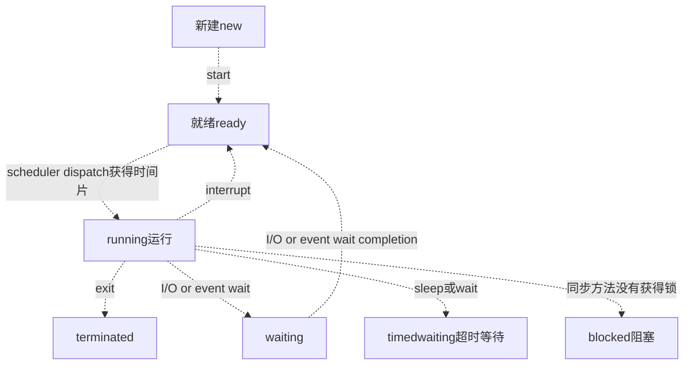

## 计算机基础知识

https://gitee.com/cosen1024/Java-Interview

多路复用:

JAVA的话，大概会问hashmap和concurrenthashmap，网上资料很多的

刚开始说到了RPC框架，因为我的项目介绍里面有，就问到了Unicode字符集的问题，然后让我简单介绍字符集，Unicode和UTF-8的区别和联系：

计算机中我们常说的Buffer和cache有什么区别，Buffer的优点是什么：

buffer是缓冲,  io先放在buffer ,然后一起write.  cache是缓存, 离cpu近, 随时可以取.

Linux 常用命令，查看内存，cpu，进程，文件等

序列化和反序列化的相关知识，用过哪些，优缺点

二进制文件和json的优缺点及使用场景

## Java

JVM内存模式简单介绍，java8 和之前的区别，以及原因：

垃圾收集算法，CMS和G1垃圾收集器的介绍，每个垃圾收集器的优点、使用原因，不同内存区域垃圾收集器组合及组合限制：

泛型的含义，实现方法，使用场景，通配符等

下面应该是秋招


面试总时长是60分钟

优先刷剑指offer题目,用java做题，然后刷leetcode前100，这些题做着做着，差不多能把ds学得差不多了。 因为你只有一年时间，肯定不会有很多精力学计算机网络和操作系统的，走捷径的话就是硬背面试常考题， 

操作系统面试常问的，网络io之类的，bio nio aio,多路复用，poll，eploo,sellect区别，银行家算法，死锁，进程线程区别。

 数据库这个考研408虽然不考，但是面试的时候这个是最喜欢会问的，mysql基本增删改查至少要会，然后背事务、b+树索引、锁、隔离、幻读、可重复读、脏读。

 java的一些基础面试题背一下，spring、springboot面试题背一下。 然后可以在csdn上找那种简单的 外卖订餐系统、电影院买票系统 视频教学 跟着做一下 动手实操一下spring+spring mvc + mybatis。 学有余力的话，学一下redis缓存、消息队列中间件、elasticsearch搜索引擎、spring cloud.

下面分享一下经验（**我先申明一下，以下所有内容都以功利性找工作为目标，就是让面试官觉得你屌，而不是让你真的变屌的思路，如果是已经工作的，可以不用看了**）： 重要性排序：**优先级递减** 第一档次:leetcode，数据库，语言基础，项目，jvm

 第二档次：计算机网络，操作系统 学到这里找个中厂的实习应该没问题了 

第三档次：各种框架，中间件，缓存，分布式知识等 

**1.学习顺序** 可以照着网课学，把SSM三大框架，还有springboot部分学完就行，如果每天从早学到晚脱产学习，从0基础到SpringBoot大概需要3~4个月 把这个网课学完以后，基本也就有了crud（搬砖）的能力，接下来的学习内容主要以应付面试为主

**2.leetcode** 算法题是目前校招最重要的考察环节，连阿里都要手撕代码了，别的基础题你不会的话，你可以说一下子忘了，或者扯点相关的知识点，算法题不会就是不会，而且笔试是实打实的成绩。得重视一下。 **另外leetcode上的《剑指offer模块》和热门100题重点做** 

**3.数据库** 上面的网课学完了以后，工作中用到数据库基本的语法也就会了，我建议深入学习一下mysql进阶的知识，建议把数据库隔离级别、索引数据结构、为什么选B+树、各种索引失效情况、最左匹配原则，如何保证事务、MVCC原理与实现、Innodb和MyISAM的区别、如何对sql调优、聚集索引和非聚集索引、mysql有哪几种锁，如何解决幻读、三大范式等高频知识点做一个整理。也可以看看《高性能Mysql》 还有就是面试的时候可能会让你手撕sql，可以去leetcode上练几道 

**4.语言基础** 我上面给的链接是java的，如果想学c++可以自己找找，如果学java的话，可以看我上面那个视频资料 

**5.项目** 说出来你可能不信，我就是做了秒杀虽然烂大街，但是好用。每次都能跟面试官扯好久,成功拖延面试时间。 当然我这是对于跨专业，且没有办法去实习的同学的建议，如果你本身是科班的，或者可以找个中厂的实习，其实企业的项目会好很多。或者也可以参加一些比赛（比如阿里的中间件比赛）。反正比赛项目或者实习项目，肯定比秒杀要好的

前提是你有这个时间去折腾，我因为只有1年时间所以来不及去折腾，只能搞了个秒杀 网上的秒杀系统项目很多，基本都大同小异，随便找一个做一下就行 B站上就有很多，举个例子 https://www.bilibili.com/video/BV1CJ411i7t8?from=search&seid=71672713836252527 如果是DIY的项目一定要突出亮点，**比如分布式锁，一致性哈希，削峰降级，多级缓存、限流算法、分布式事务等**

**6.JVM&并发相关** jvm对于java的同学来说绝对是个高频的考点，《深入理解java虚拟机》一定要好好看 并发相关知识也要学习一下，比如juc相关类，线程池相关知识、Synchronized和Lock的区别、AQS等。我的建议是先去B站找视频里看看了解基本用法和原理，然后再点到源码里看看，就会理解的比较透彻。比如我就利用AQS自己写了一个并发工具类，从此面试的时候遇到AQS都成了加分项 我同学说下面两个视频不错 https://www.bilibili.com/video/BV1V4411p7EF https://www.bilibili.com/video/BV1B7411L7tE 

**7.计算机网络，操作系统** 这两门课我都是把考研教材快速的过了一遍，大概1周看完了,看了感觉跟没看一样，然后刷了一下面筋，发现问来问去都是那些八股文：三次握手、四次挥手、tcp和udp的区别、http协议，进程与线程的区别等,这一块的复习，我建议快速过一遍教材或者网课后直接刷面筋，然后背就完了，这两门课的知识点很多，但是问来问去的知识点就那些，抓住那些常考的深入学习就行了，不常考的就算被问到了，直接说忘了，如果你算法题能做出来，面试大概率还是能通过的

**8、中间件，缓存，分布式知识** 

B站找视频学，这些中间件，我的建议是，先会用，再深入，最好能仿写。B站上找些视频学，可以快速的学习到用法，然后再去找源码看看深入理解原理，最好能做个仿写。我在秋招之前自己仿写了Spring，Dubbo，RxJava的代码，自己模仿着写了一些小框架。可以作为面试的加分项

## 进程和线程

一个进程中可以有多个线程, 多个线程共享进程的堆和方法区(元空间)资源, 但是线程有独立的PC程序计数器,栈

堆: 存放新创建的对象 

方法区主要用于存放已被加载的类信息、常量、静态变量、即时编译器编译后的代码等数据。

线程的状态

[JAVA面试题 线程的生命周期包括哪几个阶段？ - Java蚂蚁 - 博客园 (cnblogs.com)](https://www.cnblogs.com/marsitman/p/11228684.html)



1. 互斥条件：该资源任意一个时刻只由一个线程占用。
2. 请求与保持条件：一个进程因请求资源而阻塞时，对已获得的资源保持不放。
3. 不剥夺条件:线程已获得的资源在未使用完之前不能被其他线程强行剥夺，只有自己使用完毕后才释放资源。
4. 循环等待条件:若干进程之间形成一种头尾相接的循环等待资源关系。

### 说说 sleep() 方法和 wait() 方法区别和共同点?

- 两者最主要的区别在于：**`sleep()` 方法没有释放锁，而 `wait()` 方法释放了锁** 。
- 两者都可以暂停线程的执行。
- `wait()` 通常被用于线程间交互/通信，`sleep() `通常被用于暂停执行。
- `wait()` 方法被调用后，线程不会自动苏醒，需要别的线程调用同一个对象上的 `notify() `或者 `notifyAll()` 方法。`sleep() `方法执行完成后，线程会自动苏醒。或者可以使用 `wait(long timeout)` 超时后线程会自动苏醒。

### 调用 start() 方法时会执行 run() 方法，为什么不能直接调用 run() 方法

new 一个 Thread，线程进入了新建状态。调用 `start()`方法，会启动一个线程并使线程进入了就绪状态，当分配到时间片后就可以开始运行了。 `start()` 会执行线程的相应准备工作，然后自动执行 `run()` 方法的内容，这是真正的多线程工作。 但是，直接执行 `run()` 方法，会把 `run()` 方法当成一个 main 线程下的普通方法去执行，并不会在某个线程中执行它，所以这并不是多线程工作。

**总结： 调用 `start()` 方法方可启动线程并使线程进入就绪状态，直接执行 `run()` 方法的话不会以多线程的方式执行。**

### Java 容器

有哪些容器? 

先来看一下 `Collection` 接口下面的集合。

List

- `Arraylist`： `Object[]` 数组
- `Vector`：`Object[]` 数组
- `LinkedList`： 双向链表(JDK1.6 之前为循环链表，JDK1.7 取消了循环)

Set

- `HashSet`(无序，唯一): 基于 `HashMap` 实现的，底层采用 `HashMap` 来保存元素
- `LinkedHashSet`: `LinkedHashSet` 是 `HashSet` 的子类，并且其内部是通过 `LinkedHashMap` 来实现的。有点类似于我们之前说的 `LinkedHashMap` 其内部是基于 `HashMap` 实现一样，不过还是有一点点区别的
- `TreeSet`(有序，唯一): 红黑树(自平衡的排序二叉树)

##### Queue

- `PriorityQueue`: `Object[]` 数组来实现二叉堆
- `ArrayQueue`: `Object[]` 数组 + 双指针

##### Map

- `HashMap`： JDK1.8 之前 `HashMap` 由数组+链表组成的，数组是 `HashMap` 的主体，链表则是主要为了解决哈希冲突而存在的（“拉链法”解决冲突）。JDK1.8 以后在解决哈希冲突时有了较大的变化，当链表长度大于阈值（默认为 8）（将链表转换成红黑树前会判断，如果当前数组的长度小于 64，那么会选择先进行数组扩容，而不是转换为红黑树）时，将链表转化为红黑树，以减少搜索时间
- `LinkedHashMap`： `LinkedHashMap` 继承自 `HashMap`，所以它的底层仍然是基于拉链式散列结构即由数组和链表或红黑树组成。另外，`LinkedHashMap` 在上面结构的基础上，增加了一条双向链表，使得上面的结构可以保持键值对的插入顺序。同时通过对链表进行相应的操作，实现了访问顺序相关逻辑。详细可以查看：[《LinkedHashMap 源码详细分析（JDK1.8）》](https://www.imooc.com/article/22931)
- `Hashtable`： 数组+链表组成的，数组是 `Hashtable` 的主体，链表则是主要为了解决哈希冲突而存在的
- `TreeMap`： 红黑树（自平衡的排序二叉树）

#### arraylist

底层实现默认为10 , 扩容newCapacity = (int) ( 1.5 \* oldCapacity )

- 如果提前知道数组元素较多，可以在添加元素前通过调用ensureCapacity()方法提前增加容量以减小后期容量自动增长的开销。
- 也可以通过带初始容量的构造器初始化这个容量。
- ArrayList不是线程安全的。所以比较快
-  如果需要应用到多线程中，需要在外部做同步

```java
 private void grow(int minCapacity) {
    	 // 获取到ArrayList中elementData数组的内存空间长度
        int oldCapacity = elementData.length;
        // 扩容到原来的1.5倍
        int newCapacity = oldCapacity + (oldCapacity >> 1);
        // 判断一下新数组的长度容量够不够，够了就直接使用这个长度创建数组
        // 不够就将数组长度设置为需要的长度
        if (newCapacity - minCapacity < 0)
            newCapacity = minCapacity;
        // 判断预设值的大小是否超过了默认的最大值
        if (newCapacity - MAX_ARRAY_SIZE > 0)
            newCapacity = hugeCapacity(minCapacity);
        // 调用Arrays.copyOf方法将elementData数组指向新的内存空间时newCapacity的连续空间
        // 并将elementData的数据复制到新的内存空间
        elementData = Arrays.copyOf(elementData, newCapacity);
    }
```

linkedlist 双向链表, 随机访问效率低, 插入效率高. 

#### hashmap, concurrentmap

JDK1.8的实现降低锁的粒度，JDK1.7版本锁的粒度是基于Segment的，包含多个HashEntry，而JDK1.8锁的粒度就是HashEntry（首节点）

JDK1.8版本的数据结构变得更加简单，使得操作也更加清晰流畅，因为已经使用synchronized来进行同步，所以不需要分段锁的概念，也就不需要Segment这种数据结构了，由于粒度的降低，实现的复杂度也增加了

JDK1.8使用红黑树来优化链表，红黑树的遍历效率是很快的，代替一定阈值的链表.

在1.8中ConcurrentHashMap的get操作全程不需要加锁，这也是它比其他并发集合比如hashtable、用Collections.synchronizedMap()包装的hashmap;安全效率高的原因之一。

get操作全程不需要加锁是因为Node的成员val是用volatile修饰的和数组用volatile修饰没有关系。

数组用volatile修饰主要是保证在数组扩容的时候保证可见性.

##### volatile

第一：使用volatile关键字会强制将修改的值立即写入主存；

第二：使用volatile关键字的话，当线程2进行修改时，会导致线程1的工作内存中缓存变量的缓存行无效（反映到硬件层的话，就是CPU的L1或者L2缓存中对应的缓存行无效）；

第三：由于线程1的工作内存中缓存变量的缓存行无效，所以线程1再次读取变量的值时会去主存读取。

笔试: 输入有分隔的时候.

```java
 public static String[] ss = new String[20];
   public SplitDemo() {
​     String s = "The rain in Spain falls mainly in the plain.";
​     // 在每个空格字符处进行分解。
​     ss = s.split(" ");
   }
```

### JVM

#### 类加载过程

Class 文件需要加载到虚拟机中之后才能运行和使用，那么虚拟机是如何加载这些 Class 文件呢？

系统加载 Class 类型的文件主要三步：**加载->连接->初始化**。连接过程又可分为三步：**验证->准备->解析**。
